# <span style = "text-decoration:underline">EEDL: Earth Engine Downloader</span>

Python script for downloading Landsat 8, Landsat 9, and Sentinel 2 imagery from Google Earth Engine.
General options:
  * Directly download raw Landsat imagery directly
  * Directly download random Sentinel 2 mosaics in the shape of raw Landsat imagery
  * Download random Landsat mosaics with designated size to Google Drive
  * Download random Sentinel mosaics with designated size to Google Drive
A more detailed explanation of options is available in [Usage](https://github.com/CMUAbstract/eedl/edit/main/README.md#usage).

## Set-up
First you need to register with Google Earth Engine. (https://code.earthengine.google.com/)

After registering you can set up EEDL in your local environment.

In a conda environment perform the following commands:
```
conda create -n eedl --file requirements.txt
conda activate eedl
earthengine authenticate
```

## Usage

Available commands:
* ```-b, --bounds```: Specific latitude and longitude bounds to define region of interest for downloads. Defaults to region centered on Florida, USA.
* ```-g, --grid_key```: Military Grid Reference System (MGRS) designated region describing a section of the Earth. Examples: 17R, 32S. Overrides ```--bounds``` argument.
* ```-i, --idate```: Initial date for the time range of imagery to download. Format: YYYY-MM-DD, YYYY-MM, or YYYY
* ```-f, --fdate```: Final date for the time range of imagery to download. Format: YYYY-MM-DD, YYYY-MM, or YYYY
* ```-s, --scale```: Spatial resolution of imagery. Default = 164.0 meters.
* ```-m, --maxims```: Maximum number of images to download. Default = 10.
* ```-se, --sensor```: Specify the satellite sensor to download imagery from. Options: 'l8' for Landsat 8, 'l9' for Landsat 9, 's2' for Sentinel 2. Defaults to 's2'.
* ```-o, --outpath```: Specify the directory to put imagery in. Default is 'images'.
* ```-r, --region```: Custom region name for naming files. Required if using custom bounds. Defaults to ```--grid_key``` argument if not specified.
* ```-sd, --seed```: Seed for replicating downloads and random mosaics. 
* ```-c, --crs```: Specifies coordinate reference system if specific CRS desired. 
* ```-cc, --cloud_cover_max```: Float that specifies maximum percentage of cloud cover in each image. Defaults to 30.0.
* ```-ccgt, --cloud_cover_min```: Float that specifices minimum percentage of cloud cover in each image. Defaults to 0.0.
* ```-ba, --bands```: Specifies bands to include in image download. Defaults to RGB which is B4 B3 B2.
* ```-cm, --custom_mosaics```: Flag to enable custom mosaics. Switches download method from direct to Google Drive. Defaults to False.
* ```-vb, --vertical_buffer```: Vertical buffer around center point of created custom mosaic in meters. Defaults to 318816.
* ```-hb, --horizontal_buffer```: Horizontal buffer around center point of created custom mosaic in meters. Defaults to 425088.
* ```-h, --help```: Show the help message and exit.

Below are some examples of use cases:
### Downloading 500 Landsat 8 GEOTiffs from region 17R with 164 meter Ground Sample Distance (GSD) to a directory called landsat_images
Command: ```python eedl.py -g 17R -i 2022 -f 2023 -s 164 -m 500 -o landsat_images```

Result: 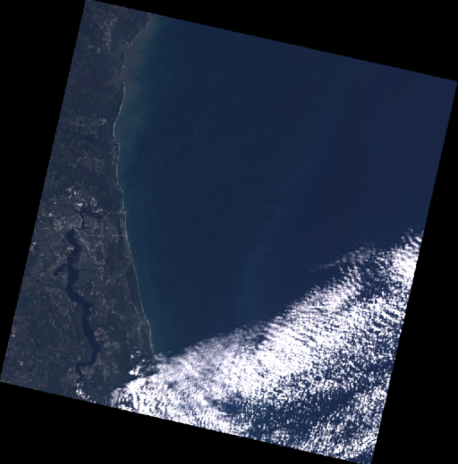 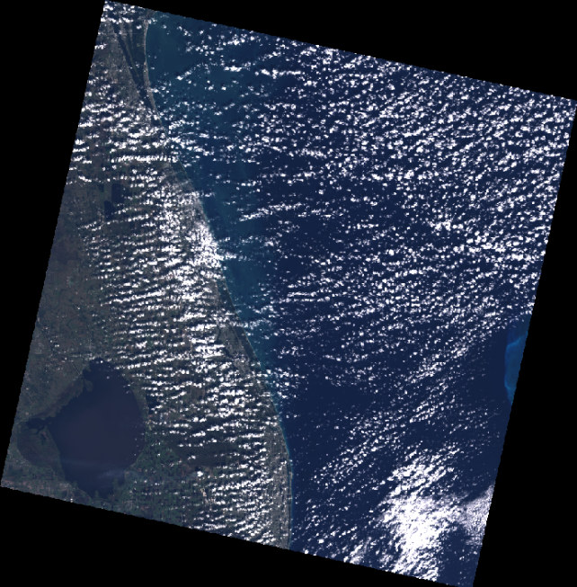 etc.

### Downloading 10 Sentinel 2 GEOTiffs from region 17R with 250 meter GSD to a directory called s2_images

Command: ```python eedl.py -g 17R -i 2020 -f 2023 -s 250 -m 10 -o s2_images -se s2```

Result: 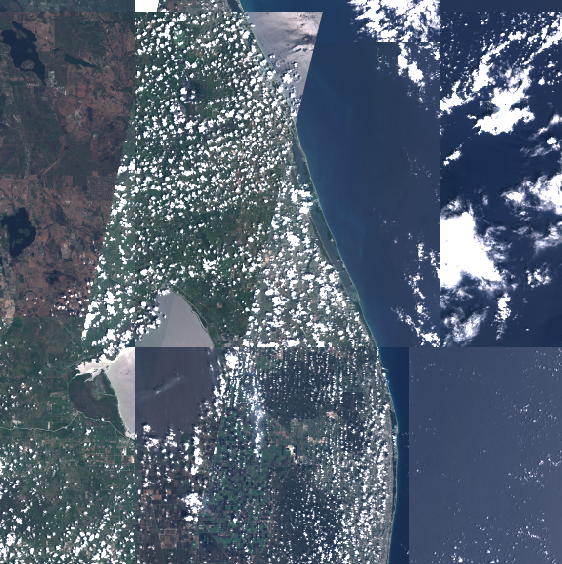 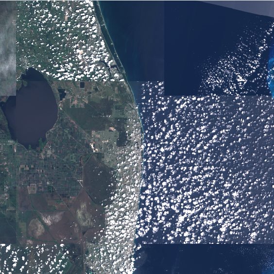 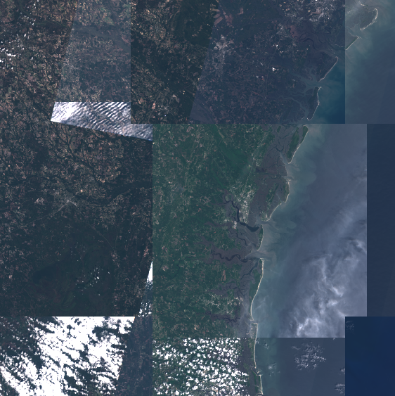 etc

### Downloading 3 Landsat 9 GEOTiff custom random mosaics centered in region 17R with 500 meter GSD and 500 km width and height to a directory called l9_17R_mos at the root of Google Drive with crs EPSG:4326.

Command: ```python eedl.py -g 17R -i 2022 -f 2023-06-15 -s 500 -cm True -vb 250000 -hb 250000 -o l9_17R_mos -se l9 -m 3 -c EPSG:4326```

Result: 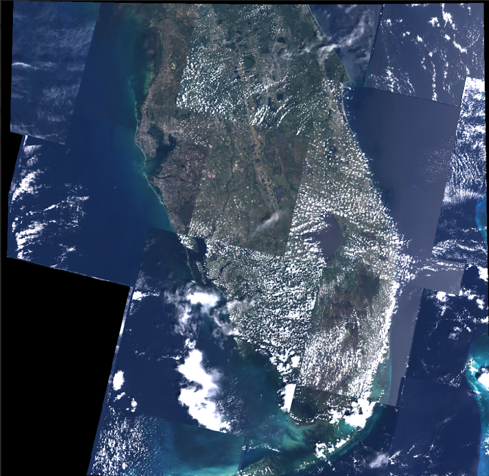 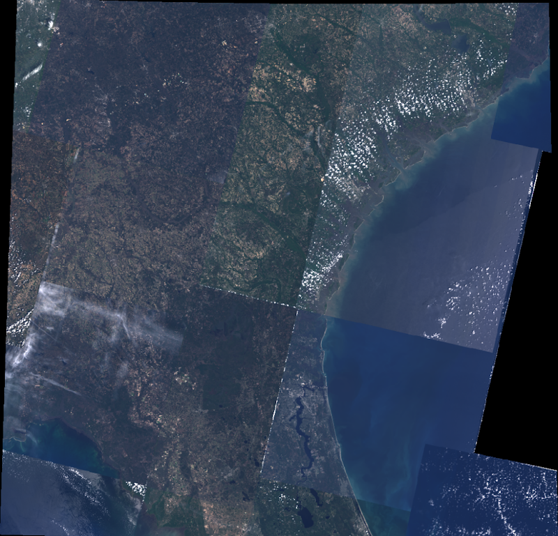 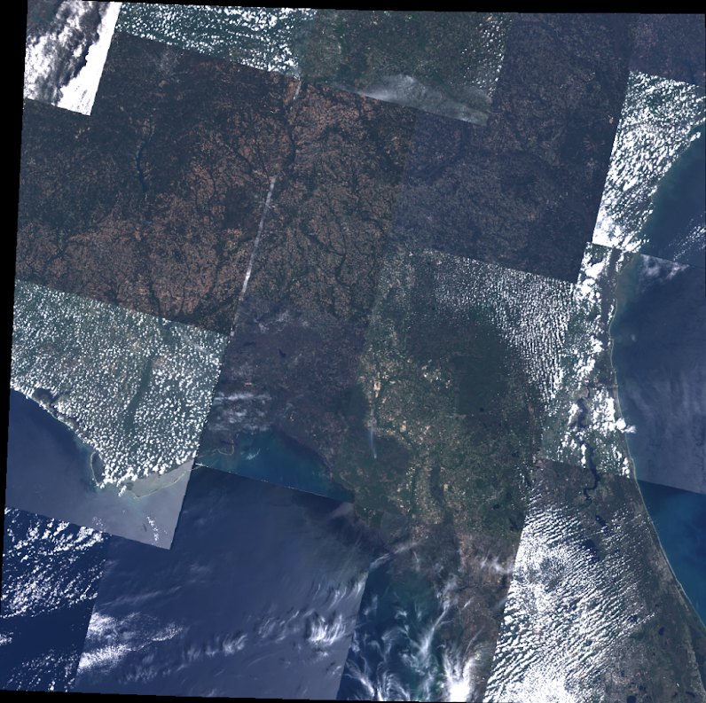

### Downloading 3 Landsat Sentinel 2 GEOTiff custom random mosaics centered in region 17R with 1000 meter GSD, 637,632 meter height, and 850,176 meter width to a directory called s2_17R_mos at the root of Google Drive with crs EPSG:4326.

Command: ```python eedl.py -g 17R -i 2022 -f 2023 -s 1000 -cm True -o s2_17R_mos -se s2 -m 3 -c EPSG:4326```

Result: 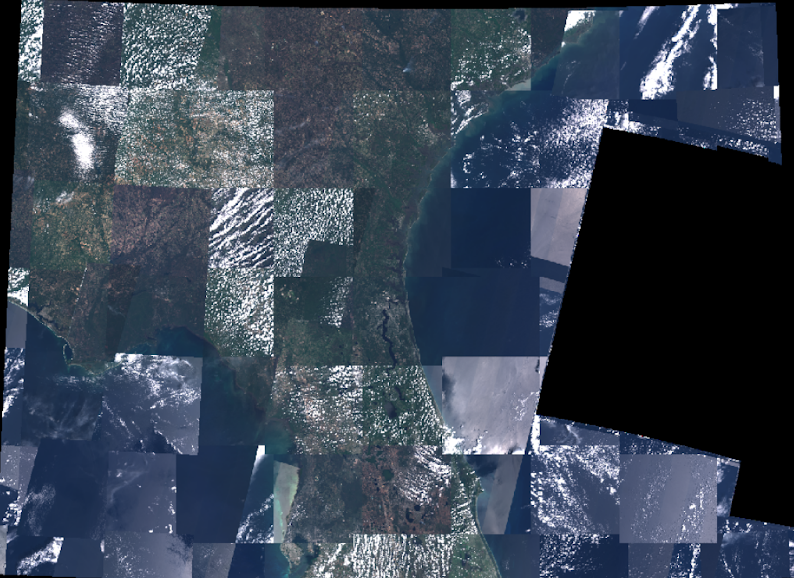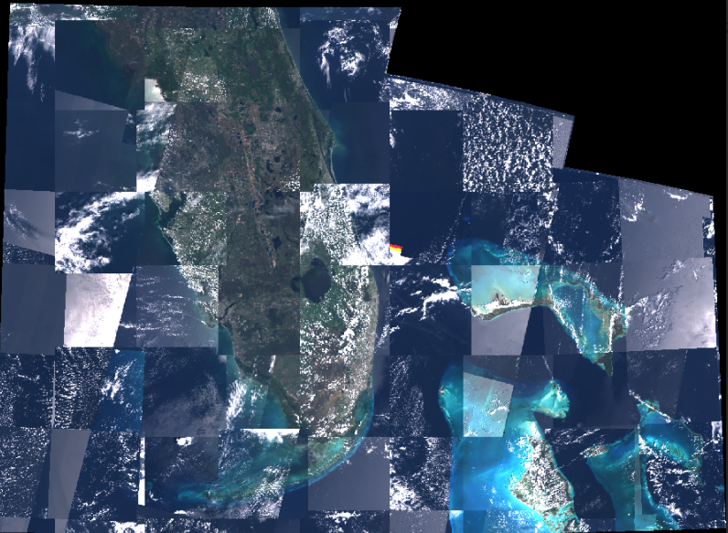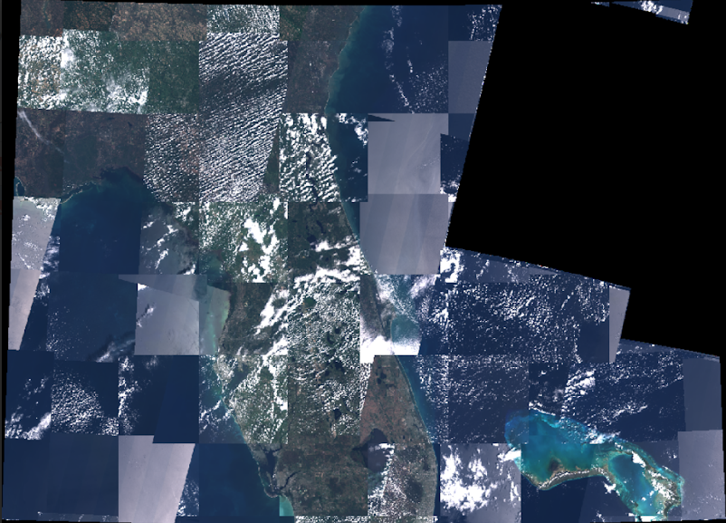